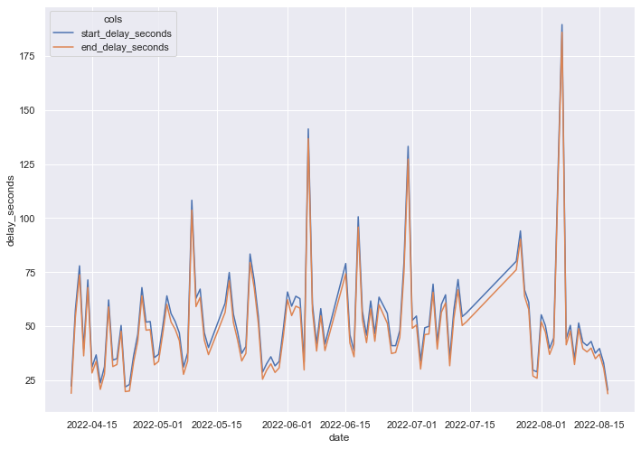
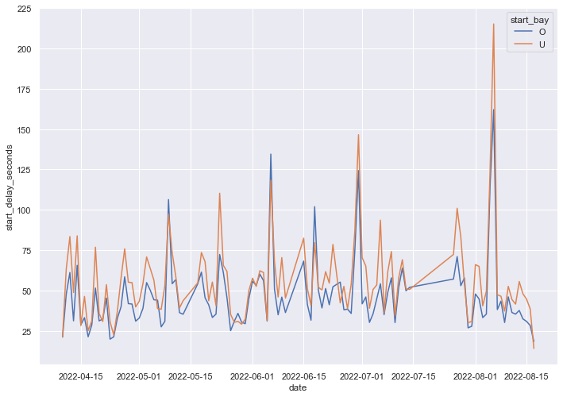
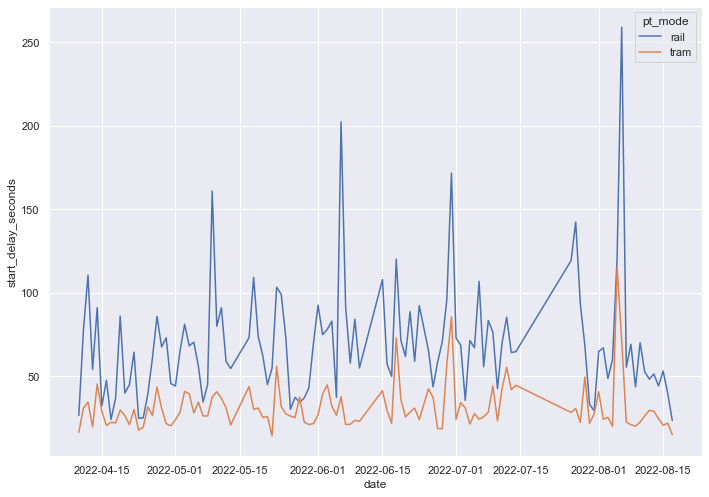

# Data Analysis - KVV


```python
import pandas as pd
from sqlalchemy import create_engine
import seaborn as sns
```


```python
root = '../Database/database.db'
```


```python
engine = create_engine('sqlite:///' + root)
```


```python
#pd.set_option('display.max_rows', None)
```


```python
df = pd.read_sql('Fahrtanfragen', engine)
```


```python
df = df.drop_duplicates(subset=['start', 'end', 'start_soll', 'end_soll'], keep='last')
```


```python
df['start_delay_seconds'] = (df['start_ist'] - df['start_soll']).dt.total_seconds()
df['end_delay_seconds'] = (df['end_ist'] - df['end_soll']).dt.total_seconds()
```


```python
df['start_delay_minutes'] = df['start_delay_seconds'] / 60
df['end_delay_minutes'] = df['end_delay_seconds'] / 60
df['start_delay_hours'] = df['start_delay_minutes'] / 60
df['end_delay_hours'] = df['end_delay_minutes'] / 60
```


```python
df['date'] = pd.to_datetime(df['start_soll']).dt.date
df['day'] = pd.to_datetime(df['date']).dt.weekday
df.loc[(df.day == 0),'day'] = 'mon'
df.loc[(df.day == 1),'day'] = 'tue'
df.loc[(df.day == 2),'day'] = 'wen'
df.loc[(df.day == 3),'day'] = 'thu'
df.loc[(df.day == 4),'day'] = 'fri'
df.loc[(df.day == 5),'day'] = 'sat'
df.loc[(df.day == 6),'day'] = 'son'
df['hour'] = pd.to_datetime(df['start_soll']).dt.hour
```


```python
df
```


<div>
<style scoped>
    .dataframe tbody tr th:only-of-type {
        vertical-align: middle;
    }

    .dataframe tbody tr th {
        vertical-align: top;
    }

    .dataframe thead th {
        text-align: right;
    }
</style>
<table border="1" class="dataframe">
  <thead>
    <tr style="text-align: right;">
      <th></th>
      <th>timestamp</th>
      <th>start</th>
      <th>end</th>
      <th>start_bay</th>
      <th>end_bay</th>
      <th>start_soll</th>
      <th>start_ist</th>
      <th>end_soll</th>
      <th>end_ist</th>
      <th>line_ref</th>
      <th>...</th>
      <th>pt_mode</th>
      <th>start_delay_seconds</th>
      <th>end_delay_seconds</th>
      <th>start_delay_minutes</th>
      <th>end_delay_minutes</th>
      <th>start_delay_hours</th>
      <th>end_delay_hours</th>
      <th>date</th>
      <th>day</th>
      <th>hour</th>
    </tr>
  </thead>
  <tbody>
    <tr>
      <th>1</th>
      <td>2022-04-10 20:46:35</td>
      <td>de:08212:1011</td>
      <td>de:08212:1012</td>
      <td>U</td>
      <td>U</td>
      <td>2022-04-10 18:46:00</td>
      <td>2022-04-10 18:46:00</td>
      <td>2022-04-10 18:47:00</td>
      <td>2022-04-10 18:47:00</td>
      <td>22010</td>
      <td>...</td>
      <td>rail</td>
      <td>0.0</td>
      <td>0.0</td>
      <td>0.0</td>
      <td>0.0</td>
      <td>0.000000</td>
      <td>0.000000</td>
      <td>2022-04-10</td>
      <td>son</td>
      <td>18.0</td>
    </tr>
    <tr>
      <th>2</th>
      <td>2022-04-10 20:46:35</td>
      <td>de:07334:1731</td>
      <td>de:07334:1714</td>
      <td>None</td>
      <td>O</td>
      <td>2022-04-10 18:46:00</td>
      <td>2022-04-10 18:46:00</td>
      <td>2022-04-10 18:48:00</td>
      <td>2022-04-10 18:48:00</td>
      <td>22015</td>
      <td>...</td>
      <td>rail</td>
      <td>0.0</td>
      <td>0.0</td>
      <td>0.0</td>
      <td>0.0</td>
      <td>0.000000</td>
      <td>0.000000</td>
      <td>2022-04-10</td>
      <td>son</td>
      <td>18.0</td>
    </tr>
    <tr>
      <th>3</th>
      <td>2022-04-10 20:46:35</td>
      <td>de:07334:1739</td>
      <td>de:07334:1736</td>
      <td>O</td>
      <td>O</td>
      <td>2022-04-10 18:46:00</td>
      <td>2022-04-10 18:46:00</td>
      <td>2022-04-10 18:47:00</td>
      <td>2022-04-10 18:47:00</td>
      <td>22015</td>
      <td>...</td>
      <td>rail</td>
      <td>0.0</td>
      <td>0.0</td>
      <td>0.0</td>
      <td>0.0</td>
      <td>0.000000</td>
      <td>0.000000</td>
      <td>2022-04-10</td>
      <td>son</td>
      <td>18.0</td>
    </tr>
    <tr>
      <th>4</th>
      <td>2022-04-10 20:46:35</td>
      <td>de:08212:802</td>
      <td>de:08212:10</td>
      <td>O</td>
      <td>O</td>
      <td>2022-04-10 18:46:00</td>
      <td>2022-04-10 18:46:00</td>
      <td>2022-04-10 18:47:00</td>
      <td>2022-04-10 18:47:00</td>
      <td>22015</td>
      <td>...</td>
      <td>rail</td>
      <td>0.0</td>
      <td>0.0</td>
      <td>0.0</td>
      <td>0.0</td>
      <td>0.000000</td>
      <td>0.000000</td>
      <td>2022-04-10</td>
      <td>son</td>
      <td>18.0</td>
    </tr>
    <tr>
      <th>5</th>
      <td>2022-04-10 20:46:35</td>
      <td>de:08212:1003</td>
      <td>de:08212:1002</td>
      <td>U</td>
      <td>U</td>
      <td>2022-04-10 18:46:00</td>
      <td>2022-04-10 18:46:00</td>
      <td>2022-04-10 18:47:24</td>
      <td>2022-04-10 18:47:24</td>
      <td>21001</td>
      <td>...</td>
      <td>tram</td>
      <td>0.0</td>
      <td>0.0</td>
      <td>0.0</td>
      <td>0.0</td>
      <td>0.000000</td>
      <td>0.000000</td>
      <td>2022-04-10</td>
      <td>son</td>
      <td>18.0</td>
    </tr>
    <tr>
      <th>...</th>
      <td>...</td>
      <td>...</td>
      <td>...</td>
      <td>...</td>
      <td>...</td>
      <td>...</td>
      <td>...</td>
      <td>...</td>
      <td>...</td>
      <td>...</td>
      <td>...</td>
      <td>...</td>
      <td>...</td>
      <td>...</td>
      <td>...</td>
      <td>...</td>
      <td>...</td>
      <td>...</td>
      <td>...</td>
      <td>...</td>
      <td>...</td>
    </tr>
    <tr>
      <th>6422541</th>
      <td>2022-08-17 10:46:36</td>
      <td>de:08236:1717</td>
      <td>de:08231:50</td>
      <td>None</td>
      <td>None</td>
      <td>2022-08-17 08:46:00</td>
      <td>2022-08-17 08:46:00</td>
      <td>2022-08-17 08:50:00</td>
      <td>2022-08-17 08:50:00</td>
      <td>22305</td>
      <td>...</td>
      <td>rail</td>
      <td>0.0</td>
      <td>0.0</td>
      <td>0.0</td>
      <td>0.0</td>
      <td>0.000000</td>
      <td>0.000000</td>
      <td>2022-08-17</td>
      <td>wen</td>
      <td>8.0</td>
    </tr>
    <tr>
      <th>6422542</th>
      <td>2022-08-17 10:46:36</td>
      <td>de:08236:1791</td>
      <td>de:08236:1717</td>
      <td>None</td>
      <td>None</td>
      <td>2022-08-17 09:03:00</td>
      <td>2022-08-17 09:06:00</td>
      <td>2022-08-17 09:06:00</td>
      <td>2022-08-17 09:09:00</td>
      <td>22305</td>
      <td>...</td>
      <td>rail</td>
      <td>180.0</td>
      <td>180.0</td>
      <td>3.0</td>
      <td>3.0</td>
      <td>0.050000</td>
      <td>0.050000</td>
      <td>2022-08-17</td>
      <td>wen</td>
      <td>9.0</td>
    </tr>
    <tr>
      <th>6422543</th>
      <td>2022-08-17 10:46:36</td>
      <td>de:08236:1795</td>
      <td>de:08236:1792</td>
      <td>None</td>
      <td>None</td>
      <td>2022-08-17 08:54:00</td>
      <td>2022-08-17 08:54:00</td>
      <td>2022-08-17 08:56:00</td>
      <td>2022-08-17 08:56:00</td>
      <td>22305</td>
      <td>...</td>
      <td>rail</td>
      <td>0.0</td>
      <td>0.0</td>
      <td>0.0</td>
      <td>0.0</td>
      <td>0.000000</td>
      <td>0.000000</td>
      <td>2022-08-17</td>
      <td>wen</td>
      <td>8.0</td>
    </tr>
    <tr>
      <th>6422544</th>
      <td>2022-08-17 10:46:36</td>
      <td>de:08236:1793</td>
      <td>de:08236:1792</td>
      <td>None</td>
      <td>None</td>
      <td>2022-08-17 08:57:00</td>
      <td>2022-08-17 09:01:00</td>
      <td>2022-08-17 08:59:00</td>
      <td>2022-08-17 09:03:00</td>
      <td>22305</td>
      <td>...</td>
      <td>rail</td>
      <td>240.0</td>
      <td>240.0</td>
      <td>4.0</td>
      <td>4.0</td>
      <td>0.066667</td>
      <td>0.066667</td>
      <td>2022-08-17</td>
      <td>wen</td>
      <td>8.0</td>
    </tr>
    <tr>
      <th>6422545</th>
      <td>2022-08-17 10:46:36</td>
      <td>de:08236:1794</td>
      <td>de:08236:1793</td>
      <td>None</td>
      <td>None</td>
      <td>2022-08-17 08:54:00</td>
      <td>2022-08-17 08:59:00</td>
      <td>2022-08-17 08:56:00</td>
      <td>2022-08-17 09:01:00</td>
      <td>22305</td>
      <td>...</td>
      <td>rail</td>
      <td>300.0</td>
      <td>300.0</td>
      <td>5.0</td>
      <td>5.0</td>
      <td>0.083333</td>
      <td>0.083333</td>
      <td>2022-08-17</td>
      <td>wen</td>
      <td>8.0</td>
    </tr>
  </tbody>
</table>
<p>5486640 rows × 22 columns</p>
</div>


# ------

Anzahl pünktlicher Abfahrten und Ankünfte


```python
punc_start = df.loc[df.start_delay_seconds == 0].start_delay_seconds.count()
punc_end = df.loc[df.end_delay_seconds == 0].end_delay_seconds.count()
```


```python
punc_start
```


    3865016


```python
punc_end
```


    4001608


Anzahl aller Abfahrten und Ankünfte


```python
total_start = df.loc[df.start_delay_seconds.notna()].start_delay_seconds.count()
total_end = df.loc[df.end_delay_seconds.notna()].end_delay_seconds.count()
```


```python
total_start
```


    5251811


```python
total_end
```


    5253293


```python
punc_start / total_start * 100
```


    73.59396596716827


#### Der Anteil pünktlicher Abfahrten beträgt 73,59 %


```python
punc_end / total_end * 100
```


    76.17332595002792


#### Der Anteil pünktlicher Abfahrten beträgt 76,17 %

# ----------


```python
df1 = df[['date', 'hour']]
```


```python
df1 = df1.drop_duplicates()
```


```python
df2 = df1['date'].value_counts().to_frame()
```


```python
df2 = df2.reset_index()
```


```python
df2 = df2.rename(columns={'index': "date", 'date':'hour'})
```


```python
df2 = df2.loc[(df2.date != pd.Timestamp(2022,4,10)) & (df2.date != pd.Timestamp(2022,8,17)) & (df2.date != pd.Timestamp(2022,8,18))]
```

    /Users/viktorwalter/opt/anaconda3/lib/python3.9/site-packages/pandas/core/ops/array_ops.py:73: FutureWarning: Comparison of Timestamp with datetime.date is deprecated in order to match the standard library behavior. In a future version these will be considered non-comparable. Use 'ts == pd.Timestamp(date)' or 'ts.date() == date' instead.
      result = libops.scalar_compare(x.ravel(), y, op)


```python
df2
```


<div>
<style scoped>
    .dataframe tbody tr th:only-of-type {
        vertical-align: middle;
    }

    .dataframe tbody tr th {
        vertical-align: top;
    }

    .dataframe thead th {
        text-align: right;
    }
</style>
<table border="1" class="dataframe">
  <thead>
    <tr style="text-align: right;">
      <th></th>
      <th>date</th>
      <th>hour</th>
    </tr>
  </thead>
  <tbody>
    <tr>
      <th>0</th>
      <td>2022-06-09</td>
      <td>24</td>
    </tr>
    <tr>
      <th>1</th>
      <td>2022-08-16</td>
      <td>24</td>
    </tr>
    <tr>
      <th>2</th>
      <td>2022-07-04</td>
      <td>24</td>
    </tr>
    <tr>
      <th>3</th>
      <td>2022-07-03</td>
      <td>24</td>
    </tr>
    <tr>
      <th>4</th>
      <td>2022-07-02</td>
      <td>24</td>
    </tr>
    <tr>
      <th>...</th>
      <td>...</td>
      <td>...</td>
    </tr>
    <tr>
      <th>108</th>
      <td>2022-05-13</td>
      <td>11</td>
    </tr>
    <tr>
      <th>110</th>
      <td>2022-07-15</td>
      <td>5</td>
    </tr>
    <tr>
      <th>111</th>
      <td>2022-06-25</td>
      <td>5</td>
    </tr>
    <tr>
      <th>112</th>
      <td>2022-06-24</td>
      <td>5</td>
    </tr>
    <tr>
      <th>113</th>
      <td>2022-06-11</td>
      <td>4</td>
    </tr>
  </tbody>
</table>
<p>112 rows × 2 columns</p>
</div>


Es liegen Daten vor zu insgesamt 112 Tagen.


```python
df2.loc[(df2.hour < 23)]
```


<div>
<style scoped>
    .dataframe tbody tr th:only-of-type {
        vertical-align: middle;
    }

    .dataframe tbody tr th {
        vertical-align: top;
    }

    .dataframe thead th {
        text-align: right;
    }
</style>
<table border="1" class="dataframe">
  <thead>
    <tr style="text-align: right;">
      <th></th>
      <th>date</th>
      <th>hour</th>
    </tr>
  </thead>
  <tbody>
    <tr>
      <th>99</th>
      <td>2022-06-20</td>
      <td>22</td>
    </tr>
    <tr>
      <th>100</th>
      <td>2022-05-25</td>
      <td>22</td>
    </tr>
    <tr>
      <th>101</th>
      <td>2022-05-17</td>
      <td>18</td>
    </tr>
    <tr>
      <th>102</th>
      <td>2022-04-26</td>
      <td>18</td>
    </tr>
    <tr>
      <th>103</th>
      <td>2022-06-15</td>
      <td>17</td>
    </tr>
    <tr>
      <th>104</th>
      <td>2022-07-26</td>
      <td>16</td>
    </tr>
    <tr>
      <th>105</th>
      <td>2022-08-02</td>
      <td>15</td>
    </tr>
    <tr>
      <th>106</th>
      <td>2022-04-25</td>
      <td>13</td>
    </tr>
    <tr>
      <th>108</th>
      <td>2022-05-13</td>
      <td>11</td>
    </tr>
    <tr>
      <th>110</th>
      <td>2022-07-15</td>
      <td>5</td>
    </tr>
    <tr>
      <th>111</th>
      <td>2022-06-25</td>
      <td>5</td>
    </tr>
    <tr>
      <th>112</th>
      <td>2022-06-24</td>
      <td>5</td>
    </tr>
    <tr>
      <th>113</th>
      <td>2022-06-11</td>
      <td>4</td>
    </tr>
  </tbody>
</table>
</div>


Oben abgebildet sind die 13 Tage an denen zu weniger als 24 Stunden eines Tages Daten vorliegen. Für 5 Tage davon liegen zu weniger als 12 Stunden Daten vor. 


```python
df_d = df[['start_delay_seconds', 'end_delay_seconds']].loc[(df.start_delay_seconds.notna()) & (df.end_delay_seconds.notna())]
```


```python
df_d.start_delay_seconds.mean()
```


    55.265505645091096


Die durchschnittliche verspätete Abfahrt, bezogen auf alle Fahrten, beträgt 55 Sekunden.


```python
df_d.end_delay_seconds.mean()
```


    51.75419975008052


Die durchschnittliche verspätete Ankunft, bezogen auf alle Fahrten, beträgt 52 Sekunden.


```python
df_d.start_delay_seconds.median()
```


    0.0


Der Median für die verspätete Abfahrt, bezogen auf alle Fahrten, beträgt 0 Sekunden.


```python
df_d.end_delay_seconds.median()
```


    0.0


Der Median für die verspätete Ankunft, bezogen auf alle Fahrten, beträgt 0 Sekunden.


```python
df_d.loc[df_d.start_delay_seconds != 0].start_delay_seconds.mean()
```


    209.38943394265823


Die durchschnittliche verspätete Abfahrt, bezogen auf verspätete Abfahrten, beträgt 209 Sekunden.


```python
df_d.loc[df_d.end_delay_seconds != 0].end_delay_seconds.mean()
```


    217.34919290398594


Die durchschnittliche verspätete Ankunft, bezogen auf verspätete Ankünfte, beträgt 217 Sekunden.


```python
df_d.loc[df_d.start_delay_seconds != 0].start_delay_seconds.median()
```


    120.00000000000001


Der Median für die verspätete Abfahrt, bezogen auf verspätete Abfahrten, beträgt 120 Sekunden.


```python
df_d.loc[df_d.end_delay_seconds != 0].end_delay_seconds.median()
```


    120.00000000000001


Der Median für die verspätete Ankunft, bezogen auf verspätete Ankünfte, beträgt 120 Sekunden.

# --------


```python
df_a = df[['start', 'end', 'start_bay', 'end_bay', 'line_ref', 'route', 'journey_nr', 'pt_mode', 'start_delay_seconds', 'end_delay_seconds', 'date', 'day', 'hour']]
```


```python
df_a = df_a.loc[(df_a.start_delay_seconds.notna()) & (df_a.end_delay_seconds.notna())]
```


```python
sns.kdeplot(df_a.start_delay_seconds)
```


    <AxesSubplot:xlabel='start_delay_seconds', ylabel='Density'>


    

    


Verspätung ist schief verteilt. Bildung von Quartilen sinnvoll.


```python
df_stops = pd.read_sql('stopPointList', engine)
```


```python
df_stops = df_stops.rename(columns={'Station': "end"})
df_stops['StopPointName'] = df_stops['StopPointName'] + ", " + df_stops['LocationName']
df_stops = df_stops.drop(['LocationName', 'Latitude', 'Longitude'], axis=1)
df_a = pd.merge(df_a, df_stops, on='end', how='left')
```


```python
df_stops = pd.read_sql('stopPointList', engine)
```


```python
df_stops = df_stops.rename(columns={'Station': "start"})
df_stops['StopPointName'] = df_stops['StopPointName'] + ", " + df_stops['LocationName']
df_stops = df_stops.drop(['LocationName', 'Latitude', 'Longitude'], axis=1)
df_a = pd.merge(df_a, df_stops, on='start', how='left')
```


```python
df_a = df_a.drop(columns=['start', 'end'])
```


```python
df_a = df_a.rename(columns={'StopPointName_x': 'start', 'StopPointName_y': 'end'})
```


```python
df_a = df_a[['start', 'end', 'start_bay', 'end_bay', 'start_delay_seconds', 'end_delay_seconds', 'line_ref', 'route', 'journey_nr', 'pt_mode', 'date', 'day', 'hour']]
```


```python
df_a
```


<div>
<style scoped>
    .dataframe tbody tr th:only-of-type {
        vertical-align: middle;
    }

    .dataframe tbody tr th {
        vertical-align: top;
    }

    .dataframe thead th {
        text-align: right;
    }
</style>
<table border="1" class="dataframe">
  <thead>
    <tr style="text-align: right;">
      <th></th>
      <th>start</th>
      <th>end</th>
      <th>start_bay</th>
      <th>end_bay</th>
      <th>start_delay_seconds</th>
      <th>end_delay_seconds</th>
      <th>line_ref</th>
      <th>route</th>
      <th>journey_nr</th>
      <th>pt_mode</th>
      <th>date</th>
      <th>day</th>
      <th>hour</th>
    </tr>
  </thead>
  <tbody>
    <tr>
      <th>0</th>
      <td>Ettlinger Tor/Staatstheater (U), Karlsruhe</td>
      <td>Marktplatz (Pyramide U), Karlsruhe</td>
      <td>U</td>
      <td>U</td>
      <td>0.0</td>
      <td>0.0</td>
      <td>22010</td>
      <td>R</td>
      <td>17020</td>
      <td>rail</td>
      <td>2022-04-10</td>
      <td>son</td>
      <td>18.0</td>
    </tr>
    <tr>
      <th>1</th>
      <td>Alte Bahnmeisterei, Wörth (Rhein)</td>
      <td>Bahnhof, Wörth (Rhein)</td>
      <td>None</td>
      <td>O</td>
      <td>0.0</td>
      <td>0.0</td>
      <td>22015</td>
      <td>H</td>
      <td>19362</td>
      <td>rail</td>
      <td>2022-04-10</td>
      <td>son</td>
      <td>18.0</td>
    </tr>
    <tr>
      <th>2</th>
      <td>Rathaus, Wörth (Rhein)</td>
      <td>Badallee, Wörth (Rhein)</td>
      <td>O</td>
      <td>O</td>
      <td>0.0</td>
      <td>0.0</td>
      <td>22015</td>
      <td>R</td>
      <td>19315</td>
      <td>rail</td>
      <td>2022-04-10</td>
      <td>son</td>
      <td>18.0</td>
    </tr>
    <tr>
      <th>3</th>
      <td>Untermühlstraße, Durlach</td>
      <td>Bahnhof, Durlach</td>
      <td>O</td>
      <td>O</td>
      <td>0.0</td>
      <td>0.0</td>
      <td>22015</td>
      <td>H</td>
      <td>19422</td>
      <td>rail</td>
      <td>2022-04-10</td>
      <td>son</td>
      <td>18.0</td>
    </tr>
    <tr>
      <th>4</th>
      <td>Kronenplatz (U), Karlsruhe</td>
      <td>Marktplatz (Kaiserstraße U), Karlsruhe</td>
      <td>U</td>
      <td>U</td>
      <td>0.0</td>
      <td>0.0</td>
      <td>21001</td>
      <td>R</td>
      <td>135</td>
      <td>tram</td>
      <td>2022-04-10</td>
      <td>son</td>
      <td>18.0</td>
    </tr>
    <tr>
      <th>...</th>
      <td>...</td>
      <td>...</td>
      <td>...</td>
      <td>...</td>
      <td>...</td>
      <td>...</td>
      <td>...</td>
      <td>...</td>
      <td>...</td>
      <td>...</td>
      <td>...</td>
      <td>...</td>
      <td>...</td>
    </tr>
    <tr>
      <th>5250486</th>
      <td>Hauptbahnhof, Pforzheim</td>
      <td>Bahnhof, Ispringen</td>
      <td>None</td>
      <td>None</td>
      <td>0.0</td>
      <td>0.0</td>
      <td>22305</td>
      <td>R</td>
      <td>19241</td>
      <td>rail</td>
      <td>2022-08-17</td>
      <td>wen</td>
      <td>8.0</td>
    </tr>
    <tr>
      <th>5250487</th>
      <td>Bahnhof, Ispringen</td>
      <td>Ersingen, Ersingen (Kämpfelb.)</td>
      <td>None</td>
      <td>None</td>
      <td>180.0</td>
      <td>180.0</td>
      <td>22305</td>
      <td>R</td>
      <td>19215</td>
      <td>rail</td>
      <td>2022-08-17</td>
      <td>wen</td>
      <td>9.0</td>
    </tr>
    <tr>
      <th>5250488</th>
      <td>Bilfingen, Bilfingen</td>
      <td>Ersingen West, Ersingen (Kämpfelb.)</td>
      <td>None</td>
      <td>None</td>
      <td>0.0</td>
      <td>0.0</td>
      <td>22305</td>
      <td>H</td>
      <td>20148</td>
      <td>rail</td>
      <td>2022-08-17</td>
      <td>wen</td>
      <td>8.0</td>
    </tr>
    <tr>
      <th>5250489</th>
      <td>Bilfingen, Bilfingen</td>
      <td>Königsbach Bf, Königsbach (Baden)</td>
      <td>None</td>
      <td>None</td>
      <td>240.0</td>
      <td>240.0</td>
      <td>22305</td>
      <td>R</td>
      <td>19215</td>
      <td>rail</td>
      <td>2022-08-17</td>
      <td>wen</td>
      <td>8.0</td>
    </tr>
    <tr>
      <th>5250490</th>
      <td>Königsbach Bf, Königsbach (Baden)</td>
      <td>Remchingen / Wilferd.-Singen, Remchingen</td>
      <td>None</td>
      <td>None</td>
      <td>300.0</td>
      <td>300.0</td>
      <td>22305</td>
      <td>R</td>
      <td>19215</td>
      <td>rail</td>
      <td>2022-08-17</td>
      <td>wen</td>
      <td>8.0</td>
    </tr>
  </tbody>
</table>
<p>5250491 rows × 13 columns</p>
</div>


# --------


```python
df_date_avg = df_a.groupby(by='date').mean().reset_index()[['date', 'start_delay_seconds', 'end_delay_seconds']].sort_values(by='date', ascending=True)
```


```python
df_date_avg_melt = df_date_avg.melt('date', var_name='cols', value_name='delay_seconds')
```


```python
sns.set(rc={'figure.figsize':(11.7,8.27)})
```


```python
sns.lineplot(x=df_date_avg_melt.date, y=df_date_avg_melt.delay_seconds, hue=df_date_avg_melt.cols)
```


    <AxesSubplot:xlabel='date', ylabel='delay_seconds'>


    

    


Die durchschnittliche Verspätung einer Abfahrt bzw. Ankunft im gesamten Betrachtungszeitraum (Pünktliche Abfahrten bzw. Ankünfte inkludiert).

# -------


```python
df_a[['start_delay_seconds', 'start_bay', 'end_bay']].loc[(df_a['end_bay'].notna())&(df_a['start_bay'].notna())].groupby(by='start_bay').mean()
```


<div>
<style scoped>
    .dataframe tbody tr th:only-of-type {
        vertical-align: middle;
    }

    .dataframe tbody tr th {
        vertical-align: top;
    }

    .dataframe thead th {
        text-align: right;
    }
</style>
<table border="1" class="dataframe">
  <thead>
    <tr style="text-align: right;">
      <th></th>
      <th>start_delay_seconds</th>
    </tr>
    <tr>
      <th>start_bay</th>
      <th></th>
    </tr>
  </thead>
  <tbody>
    <tr>
      <th>O</th>
      <td>48.067569</td>
    </tr>
    <tr>
      <th>U</th>
      <td>58.899776</td>
    </tr>
  </tbody>
</table>
</div>


An unterirdischen Haltestellen fahren die öffentlichen Verkehrsmittel im Durchschnitt mit 10 Sekunden mehr Verspätung ab.


```python
df_bay = df_a[['date', 'start_delay_seconds', 'start_bay', 'end_bay']].loc[(df_a['end_bay'].notna())&(df_a['start_bay'].notna())].groupby(['date','start_bay']).mean().reset_index()
```


```python
sns.lineplot(x=df_bay.date, y=df_bay.start_delay_seconds, hue=df_bay.start_bay)
```


    <AxesSubplot:xlabel='date', ylabel='start_delay_seconds'>


    

    


# -----------


```python
df_a[['start_delay_seconds', 'pt_mode']].loc[df_a['pt_mode'].notna()].groupby(by='pt_mode').mean()
```


<div>
<style scoped>
    .dataframe tbody tr th:only-of-type {
        vertical-align: middle;
    }

    .dataframe tbody tr th {
        vertical-align: top;
    }

    .dataframe thead th {
        text-align: right;
    }
</style>
<table border="1" class="dataframe">
  <thead>
    <tr style="text-align: right;">
      <th></th>
      <th>start_delay_seconds</th>
    </tr>
    <tr>
      <th>pt_mode</th>
      <th></th>
    </tr>
  </thead>
  <tbody>
    <tr>
      <th>rail</th>
      <td>71.794871</td>
    </tr>
    <tr>
      <th>tram</th>
      <td>32.197863</td>
    </tr>
  </tbody>
</table>
</div>


Tram-Linien (Linie 1,2,3,4 und 5) fahren gegenüber Straßenbahnlinien (S1,S10,S11,S12,S2,S4,S5,S51,S31,S32) mit ca. 39 Sekunden weniger Verspätung ab.


```python
df_pt = df_a[['date', 'start_delay_seconds', 'pt_mode']].loc[df_a['pt_mode'].notna()].groupby(['date', 'pt_mode']).mean().reset_index()
```


```python
sns.lineplot(x=df_pt.date, y=df_pt.start_delay_seconds, hue=df_pt.pt_mode)
```


    <AxesSubplot:xlabel='date', ylabel='start_delay_seconds'>


    

    

